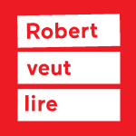

# Introduction

## A quick word about 
[Our website][ef3acaa1]
[ef3acaa1]: http://lichencommunications.com/ "Lichen communications"

- 15 years of experience in design and advertising

- Clients in many different sectors:
	- education (Educalivres)
	- publishing (Gallimard, Renaud-Bray)
	- medical equipment (Dufort & Lavigne)
	- public institutions (MAC, BANQ, Amis de la montagne)

- What we are producing :
	- websites (popup, CMS with admin, etc...)
	- apps
	- ebooks,
	- digital education platform,
	- games
	- bots (textos, messenger, ...)
	- CRMs
	- interactive scenography
	- and even hardware !

- We like to play with web technologies, we love to hack it, sometimes even break it. **Lichen is a laboratory**

---------------

## On going projects :

**Dokoma**: Streaming platform for teachers, students and family.

---------------

**Robert veut lire**: Your virtual bookseller

--------------

> _WARNING: What we’re about to present is pretty unconventional_

--------------

<!-- - WARNING: What we’re about to present is not Kosher (not conventional),  but since we worked this way its a revolution for us, now we can’t return to the old way. We use it everyday now to built ourselves and I hope it will inspire some of you. Cause, in my humble opinion, we definitely need to diversify the web. I’m sure some purist in the room will have a lot a questions about it.
- When you speak about webapps production its a bit blurry cause there is no standard. Industry is moving fast (you know it better than me), front-end technologies are growing fast but quickly deprecated.
  . For the rest of the speech, lets assume that we’re talking about webapps that structured so that backend is separated from front-end and communicate with an API
- For years we’ve been outsourcing our frontend because we couldn’t afford to produce it internally. Why? cause we wanted to build custom design & avoid precooked solutions like Bootstrap (websites are all looking the same today), and you need ressources. And we’ve always felt that is was kind of wrong.
  . as a small company, we work in a very flexible way.
  . problem of recruiting front-end developers
  . Here’s what our production looked like ( maquette indesign > bulgares > 2 weeks later we received the layouts > integration with rails > corrections > etc ….)
  . problem of mockups designed with print-oriented software (designers)
  . designers and developers are not working hand to hand.
  . as a small team we need to find best solution to accelerate learning curve to welcome new team members. -->

# Hype + Vue.js

## Why ?
- Avoid precoooked solutions: now all websites are looking the same
- Very constraining production requirements:
	- deadlines, deadlines, deadlines ...
	- low budget
	- necessity to be quick
- Get rid of **.psd** or **.indd** (_because we're in 2016_)
- **Development is very transparent** since you can export a live prototype from the very beggining of the project.
- **Improve team work** & communication (https://www.wearedesignstudio.com/works/airbnb-process/).
- Flash nostalgia ? (_Was it that bad ?_)
- The joy of breaking dogmas (_We already told you that we like that_)

## Hype
[Official website](http://tumult.com/hype/)
- Hype is amazing: checkout [examples](http://tumult.com/hype/gallery/)
- It's used by **La Presse** to handle advertising in **LaPresse+**.

	- it **generate HTML built with a designer-friendly interface**.
	- You can create shapes, texts, widgets, and beautiful animations.
	- Scenes system with transitions. Symbols, etc. Interactions handled with intern events.
	- you can assign javascript function to be called on specifics hooks.

<!-- - Is we can build pretty complex why not try to build a whole website with it ?
	. for designers the benefit is huge. We you build a prototype : you want to move the logo ? Go ahead move it it takes 2 sec. No more .psd or .indd. Also no need of the slicing process (exporting assets from photoshop)
	. the client wants to have a sneak peek at the layouts ? Just export the layout to dropbox and send the link.
	. its quick - very quick -->

<!-- - First result were very good. but … (there’s always a but)
	- app becomes very hard to maintain as it grows complex
	Hype is very good for playing with static content so we needed to find a way to inject some robust logic into it.
	=> we decided to look for a reactive library to structure our code.

- Comparison between frameworks
	. Angular needs a full control of the dom. React was a bit complex.
	=> That’s why we chose Vue.js -->

## Vue.js
Powerful lightweight reactive DOM library:

[Official website](https://vuejs.org/)
- onefile components (vueify)
- growing community
- plugins : vuex(redux), router, and many more
- devote & hotmodule replacement
- v2.0 is coming
- exemple

# Usage & features
## Architecture
- SPA (single page application)

- backend  <-----  API ----> frontend
- tools:
- devtools: gulp - browserify - babel
- router: custom
- datastore: jsdata(like ember)
- apimocks: mockserver
- icons: grunticon + component vue
- element-query
- ui components: custom and keen-ui
- mustache to inject custom data

## Pros and cons
## Cons:
- performance
- seo
- gestion du git
- contenu qui peut être séparé à deux endroits

## Benefit:
- flexible
- portable (you can get rid of hype if you want to at some point)

# Examples
[La classe numérique](https://laclasse.grandducenligne.com/v2/enseignant)

# Thanks for listening
We hope it will inspire you
# Test it !
git clone

<!-- # Conclusion

As developers we always looking for new workflows to help us in our daily work. But sometimes it can time consuming, we easily spend 10 hours per week just to search, learn and evaluate new tools/technologies. In fact, frameworks, and tools are more than just a research of efficiency, they are shaping the way we produce and deal with technologies. From a teamwork perspective, workflow is mandatory. This is why its so important and why we wanted to share our philosophy and the structure we built upon it. -->

<!-- Most of you, I guess, are working along designers, (or are designers also ) everyday. Although Javascript is getting in backend also, it has been a long time dedicated to front-end and ux. We’re not gonna talk about other aspect of javascript here. -->
